# ShieldAgentsEmployeeDatabase
Shield Agents Database with ROOM and AsyncTask

Homework Weekend 3 Research is in the root folder attached.

Coding
1. Create an object Employee.  The class should have the following member variables:
    1. FirstName
    2. LastName
    3. StreetAddress
    4. City
    5. State
    6. Zip
    7. TaxID
    8. Position
    9. Department
2. Create a database (Room or Sqlite) for the Employee object.
3. Create the following Activities:
    1. MainActivity
        1. Make this into a splash screen activity.
        2. After any initializations for the applications, start the FilterEmployeeActivity.
    2. FilterEmployeeActivity
        1. Be creative, but must at least use one spinner to select department of the employee. DEPARTMENTS MUST BE RETRIEVED FROM DATABASE.
        2. This activity will start the EmployeeListActivity.
    3. EmployeeListActivity
        1. List all the employees matching the criteria selected in the FilterEmployeeActivity.
        2. Implement a Navigation drawer here for the following activities.  Since this activities will be also be called from the Employee details activity, you will need to devise a way to get the info for a specific employee both without the employee known and with the employee known.
            1. NewEmployeeActivity
            2. DeleteEmployeeActivity
            3. UpdateEmployeeActivity
            4. FilterEmployeeActivity
    4. NewEmployeeActivity
        1. Allows the user to enter a new employee into the database.
        2. Once operation is complete, go back to the Listing activity.
        3. When insert is complete, display a toast letting user know which employee was deleted
    5. DeleteEmployeeActivity
        1. Allow user to delete an employee from the database.
        2. Once operation is complete, go back to the Listing activity.
        3. When delete is complete, display a toast letting user know which employee was deleted
    6. UpdateEmployeeActivity
        1. Allow user toupdate an employee from the database.
        2. Once operation is complete, go back to the Listing activity.
        3. When update is complete, display a toast letting user know which employee was deleted
    7. EmployeeDetailsActivity
        1. Display all info about the employee.
        2. Be able to pass the employee to the following activities.
            1. DeleteEmployeeActivity
            2. UpdateEmployeeActivity
4. ALL DATABASE OPERATIONS MUST BE HANDLED BY A WORKER THREAD.  You can use any scheme we have covered or one of the following:
    1. Loopers
    2. Loaders
    3. ThreadPools
5. All activities except Main, filter, and list activities must have backward support.  (The back arrow in the left side of action bar)
6. Main, splash, and list must use single instance, all others must use single task.
7. Any activity that requires user input must account for configurational changes in some way.
8. Feel free to experiment with any UI element

Instructions:

- Run the Android project
- Create a new Virtual Device if not already. Then, choose Pixel 2 XL, then click OK.
- User can add a department or view departments.
- User then can go to the filter employee activity.
- User can filter employees by department, add new employee, or view all employees
- There is also a navigational window in the view employees activity.

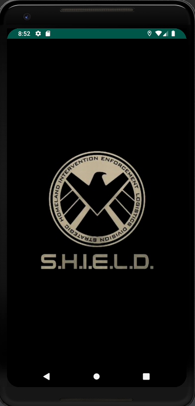
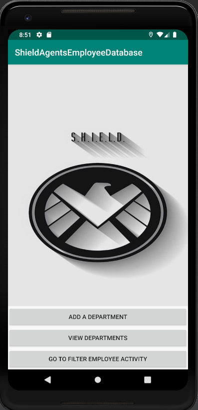
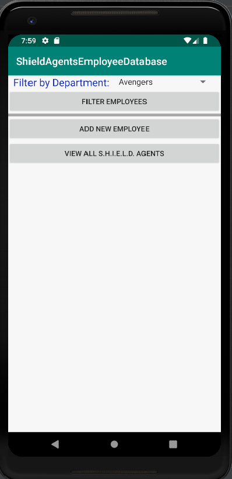
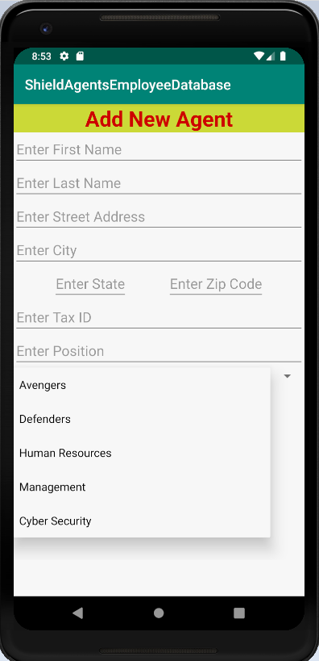
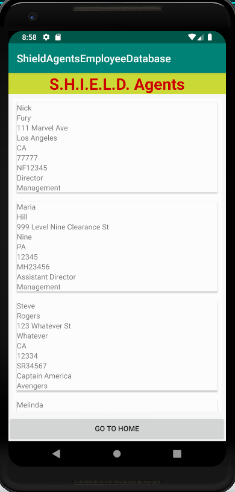
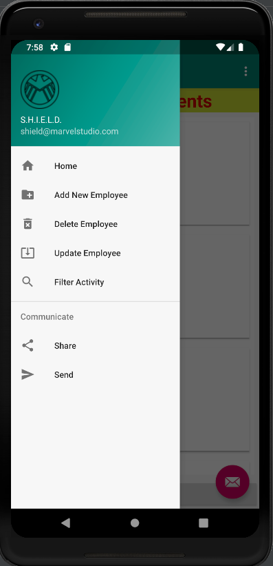
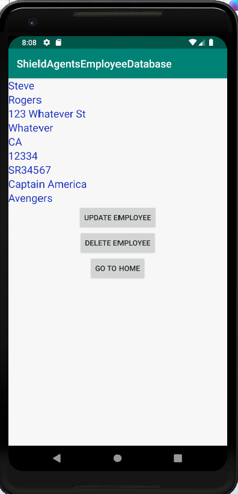
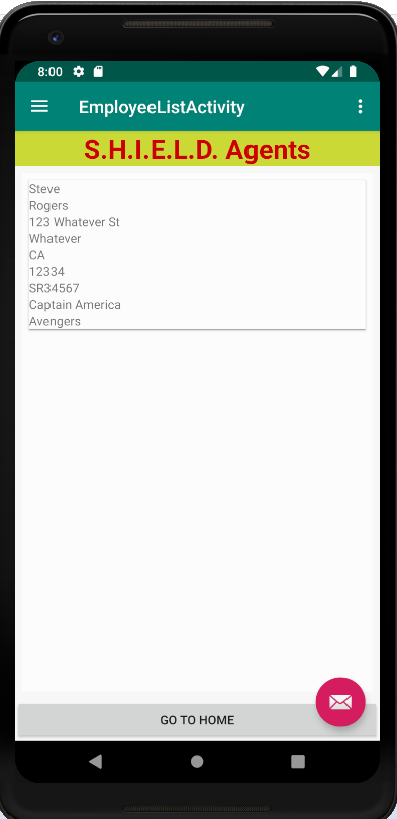
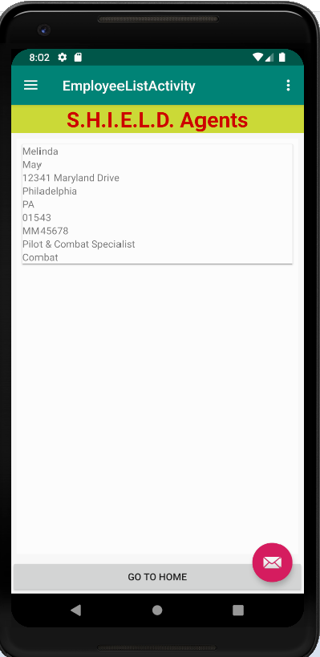
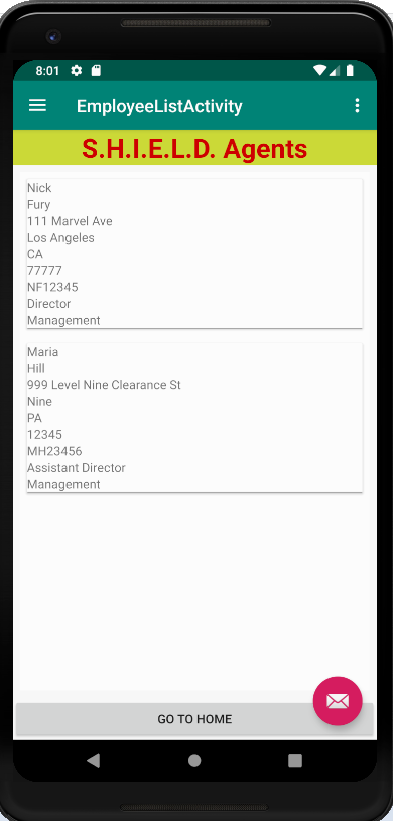
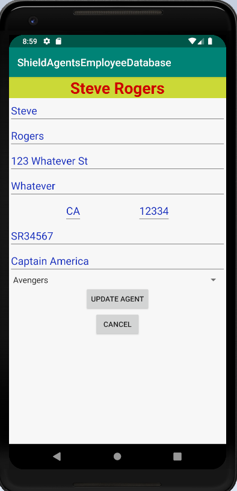
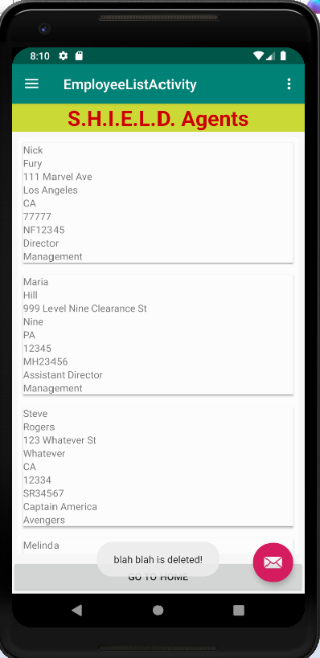

